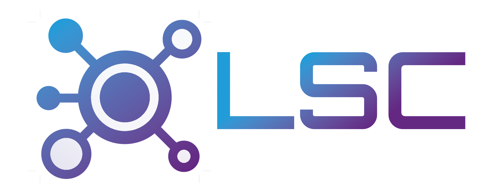

<p align="center">
  
</p>

<h1 align="center">LanCore</h1>

<p align="center">
  <strong>LAN Party & BYOD Event Management Platform</strong><br>
  The modern successor to eventula-manager. Inspired by Byceps and 10 years of LAN party experience at <a href="https://sxlan.de">sxlan.de</a>.
</p>

<p align="center">
  <a href="https://github.com/lan-software/LanCore/actions/workflows/tests.yml"></a>
  <a href="https://github.com/lan-software/LanCore/actions/workflows/vitest.yml"></a>
  <a href="https://github.com/lan-software/LanCore/actions/workflows/playwright.yml"></a>
  <a href="https://github.com/lan-software/LanCore/actions/workflows/lint.yml"></a>
  <a href="https://github.com/lan-software/LanCore/actions/workflows/docker-publish.yml"></a>
  <a href="https://codecov.io/gh/lan-software/LanCore"></a>
</p>

<p align="center">
  
  
  
  
  
</p>

---

## About

LanCore is a self-hosted web application for organizing LAN parties and BYOD events. Built on **Laravel 13 + Inertia.js v2 + Vue 3**, it replaces the legacy eventula-manager with a clean, domain-driven architecture designed for extensibility and maintainability.

What started as a three-day tech demo quickly evolved into a comprehensive event management platform covering ticketing, payments, seating, scheduling, notifications, and more.

> **Status:** Pre-release (Proof of Concept) — core domains are functional, some areas are still in progress.
>
> **Do not use in production until v1.0.**

---

## Features

| Domain | Description | Status |
|--------|-------------|--------|
| Event Management | Create, publish, and manage events with configurable settings | Done |
| Venue Management | Venues with address data, images, and event association | Done |
| Ticketing | Ticket types, categories, add-ons, assignment, and transfer | Done |
| Shop & Checkout | Shopping cart, vouchers, purchase conditions, acknowledgements | Done |
| Stripe Payments | Stripe Checkout with webhook-based fulfillment via Laravel Cashier | Done |
| Seating Plans | Canvas-based seat plan editor with drag-and-drop assignment | Done |
| Programs & Scheduling | Time slots, speaker assignment, subscriber notifications | Done |
| Announcements & News | Rich-text articles, comments, voting, and push notifications | Done |
| Sponsor Integration | Sponsor profiles, tiers, and event association | Done |
| Notifications | Web Push, email, and in-app notifications with user preferences | In Testing |
| User Authentication | Registration, 2FA (TOTP), password reset, role-based access | Done |
| Profile Management | Address, contact info, and profile completeness enforcement | Done |
| Achievement System | Event-driven achievements with configurable triggers | Done |
| Integration API | REST API with SSO, webhooks, and third-party app connectivity | Done |
| Responsive UI | Mobile and desktop-friendly interface with dark mode | Done |
| Tournament Management | Brackets and match management | Planned |
| Game Server Management | Pelican Panel integration | Planned |

---

## Architecture

LanCore follows a **domain-driven design** with 14 bounded contexts organized under `app/Domain/`. Each domain encapsulates its own models, actions, controllers, events, listeners, and policies.

```
app/Domain/
  Event/          Ticketing/        Shop/           Program/
  Seating/        Sponsoring/       News/           Announcement/
  Notification/   Integration/      Webhook/        Games/
  Achievements/   Venue/
```

Key architectural decisions:

- **Actions pattern** for business logic (not fat controllers or service classes)
- **Contracts & interfaces** for extensibility (e.g., `Purchasable`, `PaymentProvider`)
- **Event-driven** side effects via listeners
- **Laravel Octane** (FrankenPHP) for high-performance serving

---

## Documentation (MIL-STD-498)

This project maintains formal software documentation following the **MIL-STD-498** standard. The complete document set provides requirements traceability from system specifications down to test reports.

| Document | Title | Description |
|----------|-------|-------------|
| [OCD](docs/mil-std-498/OCD.md) | Operational Concept Description | User classes, operational scenarios, system context |
| [SSS](docs/mil-std-498/SSS.md) | System/Subsystem Specification | System-level capability requirements |
| [SRS](docs/mil-std-498/SRS.md) | Software Requirements Specification | CSCI-level feature requirements per domain |
| [IRS](docs/mil-std-498/IRS.md) | Interface Requirements Specification | External interface requirements (Stripe, S3, SMTP, etc.) |
| [SDD](docs/mil-std-498/SDD.md) | Software Design Description | Architecture, component inventory, middleware pipeline |
| [IDD](docs/mil-std-498/IDD.md) | Interface Design Description | API design, SSO flow, webhook design, Stripe integration |
| [DBDD](docs/mil-std-498/DBDD.md) | Database Design Description | Complete schema documentation (77+ tables) |
| [STP](docs/mil-std-498/STP.md) | Software Test Plan | Test strategy, environment, and execution approach |
| [STD](docs/mil-std-498/STD.md) | Software Test Description | Individual test cases with preconditions and expected results |
| [STR](docs/mil-std-498/STR.md) | Software Test Report | Test results, coverage metrics, gap analysis |
| [SUM](docs/mil-std-498/SUM.md) | Software User Manual | End-user procedures for attendees and administrators |
| [SPS](docs/mil-std-498/SPS.md) | Software Product Specification | Source tree, build process, deployment artifacts |
| [SVD](docs/mil-std-498/SVD.md) | Software Version Description | Version identification, runtime dependencies |
| [SDP](docs/mil-std-498/SDP.md) | Software Development Plan | Development process, coding standards, organization |

> See the full [document index](docs/mil-std-498/README.md) for additional documents including installation, transition, and operator manuals.

---

## Tech Stack

| Layer | Technology |
|-------|-----------|
| Backend | PHP 8.5, Laravel 13, Laravel Octane (FrankenPHP) |
| Frontend | Vue 3, Inertia.js v2, Tailwind CSS v4 |
| Authentication | Laravel Fortify (2FA, password reset, email verification) |
| Payments | Laravel Cashier v16 (Stripe Checkout, webhooks) |
| Database | PostgreSQL, Redis |
| Storage | S3-compatible (AWS S3, Minio, Garage) |
| Testing | Pest v4, Vitest, Playwright |
| CI/CD | GitHub Actions, Codecov |
| Containers | Docker, Laravel Sail |
| Monitoring | Laravel Pulse, Telescope, Horizon |

---

## Local Development

> **Running LanCore alongside the other Lan\* apps?** Start with [`platform/README.md`](../platform/README.md) — it boots the shared PostgreSQL / Redis / Mailpit infrastructure on the external `lanparty` Docker network that every satellite (LanShout, LanBrackets, LanHelp, LanEntrance) joins. The steps below cover LanCore on its own; if you skip the `platform/dev/setup.sh` bootstrap, Sail will fail to start because the `lanparty` network will not exist.

### Prerequisites

- [Docker](https://docs.docker.com/get-docker/) & Docker Compose
- The shared infrastructure running: `cd ../platform/dev && ./setup.sh`

### Getting Started

```bash
# 1. Clone the repository
git clone https://github.com/lan-software/LanCore.git
cd LanCore

# 2. Install PHP dependencies
docker run --rm -v "$(pwd)":/opt -w /opt laravelsail/php85-composer:latest composer install --ignore-platform-reqs

# 3. Copy environment file and generate app key
cp .env.example .env
vendor/bin/sail artisan key:generate

# 3.1 Generate VAPID keys for browser push notifications
vendor/bin/sail artisan webpush:vapid

# Copy the generated VAPID_PUBLIC_KEY and VAPID_PRIVATE_KEY into .env

# 4. Start containers
vendor/bin/sail up -d

# 5. Run database migrations and seeders
vendor/bin/sail artisan migrate --seed

# 6. Install JS dependencies and start Vite dev server
vendor/bin/sail npm install
vendor/bin/sail npm run dev
```

The application will be available at **http://localhost**.

### Registering satellite apps

LanCore integrations (LanBrackets, LanEntrance, LanShout, LanHelp) are declared in `config/integrations.php` and driven by environment variables. After the first `migrate`, reconcile them into the database so each satellite gets a token and webhook subscriptions:

```bash
vendor/bin/sail artisan integrations:sync
```

Copy the minted tokens into each satellite's `.env` as `LANCORE_TOKEN`. See [`platform/README.md`](../platform/README.md#lancore--satellite-app-integration) for the full wiring, including the `http://lancore.test` in-network hostname used for server-to-server calls.

### Web Push Notifications

LanCore uses VAPID keys for browser push notifications. Add these variables to your local `.env`:

```env
VAPID_PUBLIC_KEY=
VAPID_PRIVATE_KEY=
```

Generate the key pair with:

```bash
vendor/bin/sail artisan webpush:vapid
```

The command prints `VAPID_PUBLIC_KEY=...` and `VAPID_PRIVATE_KEY=...`. Copy those values into `.env`, then restart the application containers or reload the config so push subscription requests use the new keys.

### Common Commands

```bash
vendor/bin/sail artisan test --compact       # Run backend tests
vendor/bin/sail bin pint                      # Format PHP
vendor/bin/sail npm run format               # Format JS/Vue
vendor/bin/sail npm run lint                  # Lint JS/Vue
vendor/bin/sail npm run build                # Build frontend assets
vendor/bin/sail artisan pail                 # Tail application logs
vendor/bin/sail open                         # Open in browser
```

---

## Ecosystem

LanCore is part of a broader ecosystem of applications designed for LAN event organizers:

| Application | Description | Status |
|-------------|-------------|--------|
| **LanCore** | Event management platform (this repository) | Pre-release |
| **LanShout** | Shoutbox for live event communication | Integrated |
| **LanBrackets** | Tournament bracket and match management | Architecture WIP |
| **LanEntrance** | Check-in client for validating and guiding arriving guests | Architecture WIP |
| **LanHelp** | Help desk for issues, FAQ, and knowledge base | Requirements Ready |
| **LanVote** | Voting platform for event polls | Requirements Ready |
| **LanOrder** | Group food ordering for event attendees | Open |
| **LanDisplay** | Web-based display screens (OBS-compatible) | Open |

---

## CI/CD

All pushes and pull requests run through automated pipelines:

- **tests.yml** — PHP 8.5, Pest tests, coverage upload to Codecov
- **vitest.yml** — Vitest component tests, coverage upload to Codecov
- **playwright.yml** — Playwright end-to-end tests against a live Laravel server
- **lint.yml** — Pint, ESLint, Prettier
- **docker-publish.yml** — Multi-architecture Docker image builds

Performance and load testing with K6 is planned for pre-release validation.

---

## License

This project is not yet licensed for public use. A license will be determined before the v1.0 release.
